# Implementing Adaptive Virtual Texture in HDRP
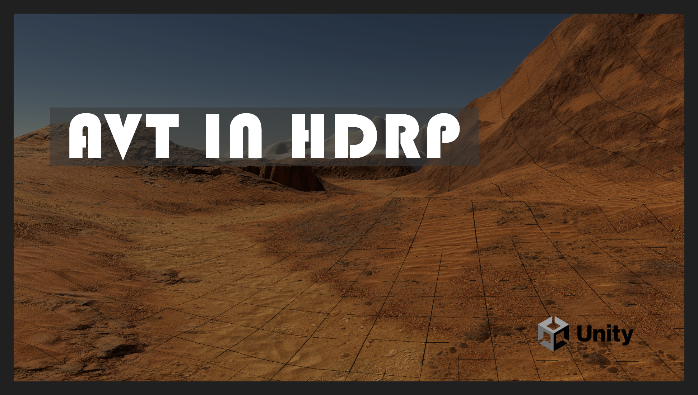
### 摘要
项目上线了，终于有时间重新梳理，再次复习一下之前的工作，记录一下实现AVT过程中遇到的细节，顺便开源了核心实现，抛砖引玉。希望大佬们多多开源好东西出来大家一起学习进步。
- https://github.com/lifangjie/HDRPVirtualTexture
### 正文
不熟悉Virtual Texture概念和上下文的读者，可以先参阅前辈们的分享，附在文末。

Chen Ka分享的Adaptive Virtual Textures (AVT) 是对Virtual texture应用于超大范围世界的一个改进。举个每米256精度的例子来说传统的2KM地形VT需要一个2K\*2K的Indirection Texture来索引Physical Page。在这个例子中，每个indirection pixel代表地形中的一米的格子。这个格子对应一个256\*256 pixels的Physical Page。那么Indirection Texture的mip1中的pixel就是2米的地形对应一个Physical Page，刚好Indirection Texture的mip1就是1K\*1K，所以Indirection Texture上记录的就是Physical Page atlas的索引，或者说叫Entry。但是当地形无限扩大，精度提升到比如每米1024的时候，我们就会发现Indirection Texture的尺寸会变得非常夸张，比如16KM\*16KM每米256的地形就需要16K\*16K的indirection pixels。更别说提高地形精度了，每米1024的精度下，每0.25米地形就对应了一个Physical Page。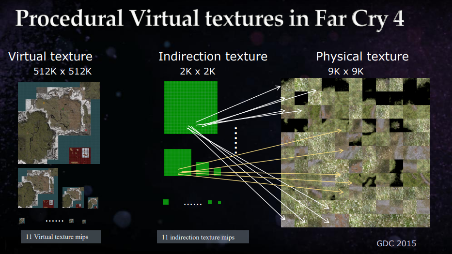

AVT的思想就是把Virtual Image本身也看成一个动态图集，运行时最多只有2K\*2K的Indirection Texture，靠近摄像机的Virtual Image在此间分配256\*256 pixels作为Entry，乘上Physical Page size256，就是Chen Ka文中的65536的Virtual Image，64K的Virtual Image贴在64米的sector上就是每米1024的精度。远一些的sector就只分配128\*128的pixels，直白一些的解释就是，视距远一些的sector不可能使用到最高精度的mip0，所以可以抛弃掉mip0的Entry，再远一些就只保留mip2即64\*64，以此类推，随视距动态切换sector对应的Virtual Image大小，这样Indirection Texture作为一个2K的图集就足够使用了，本文的实现中只使用了1K\*1K的Indirection Texture。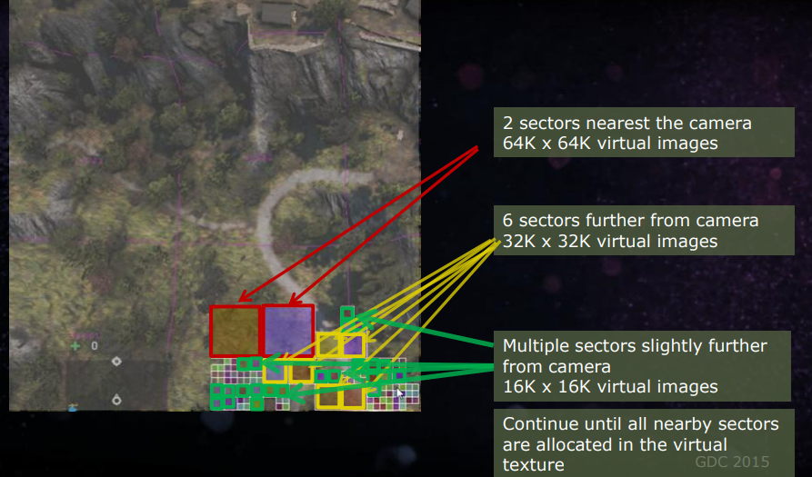

这里隐含了一个问题就是最多只能表达每米1024精度下的mip8，即每米4个像素，因为256\*256的mip8或者128\*128的mip7就只有1个pixel（entry）了。之前以为mip会不够大，视距不够用，思考了很久都没想通，之后实现出来发现aniso8X下mip8已经非常远了，如果配上4K分辨率甚至能到300，400米。其次来说，0-8级mip对于far cry 4来说刚刚好从1米1024texels降低到1米4texels，正好能够衔接远景basecolor的精度每米2texels（😊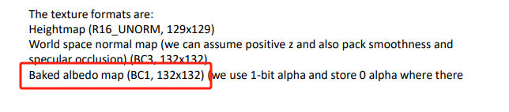

开启page边缘显示模式我们可以看到2K分辨率下请求的mip精细很多。
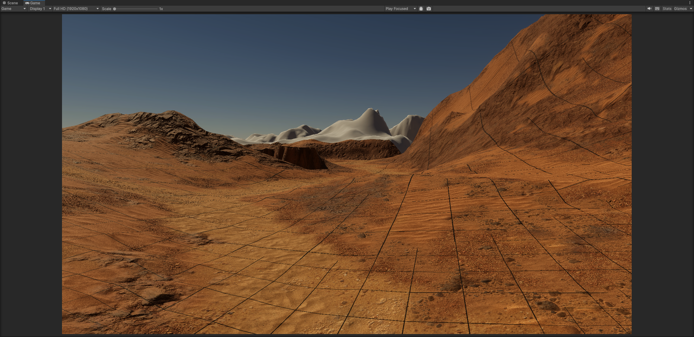
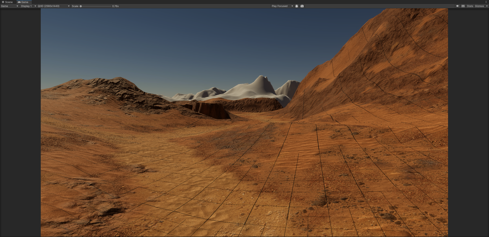
### 实现细节
- 实现一个高效的POT图集分配算法，下图展示了两个不同的摄像机位置下分配的virtual image
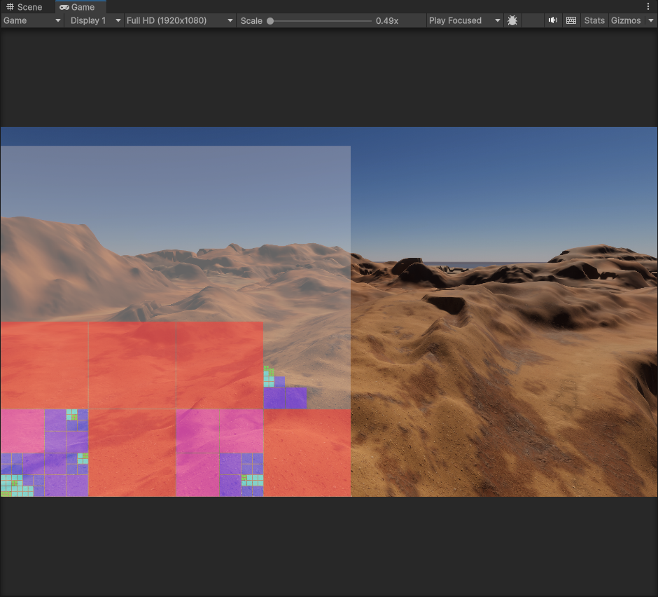
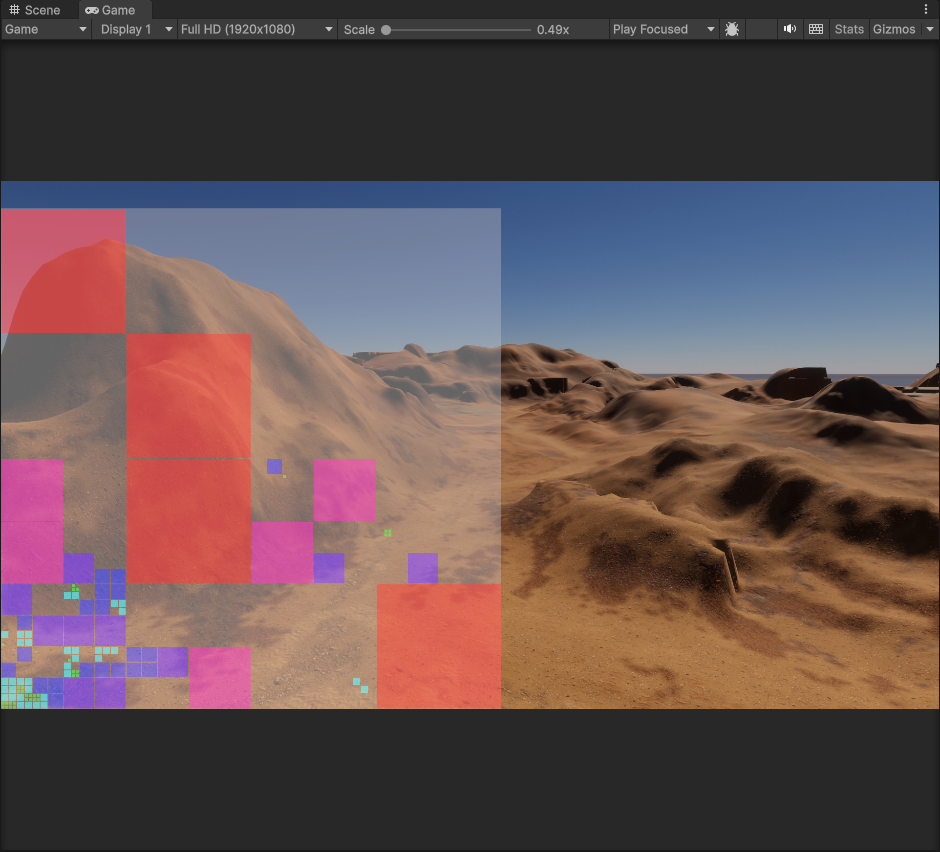
  - 构建一个四叉树，即一个image可被均分为四个1/4大小的subimage
  - 四叉树中如果一个节点存在（被占用），要么节点本身被分配了image，要么是他的子节点中被分配了subimage

  - 使用深度优先遍历可以让相同大小的节点分配聚集在一起
  - 因为resize virtual image的时候需要复用Entry，Chen Ka分享文中称作remap，remap的时候涉及gpu操作，所以这里需要注意一下resize之后不要直接在释放出来的位置分配新的virtual image。这里有两个trick，一种是可以一帧只处理一个sector的resize，但是这会导致所有sector resize完成的时间被延长。二是先处理完所有resize sector的分配，然后逐一做remap操作，最后才做释放。但是这种方法会对图集总大小提出额外的要求，当摄像机位置变动较大的时候，有大量sector会同时resize，这些sector在释放自身空间前就在图集中申请分配了新的空间。
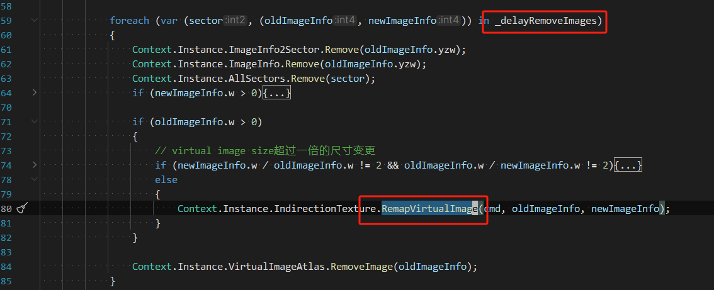
- 关于Feedback
  - Deduplicate output page ID性能优化的三个思路
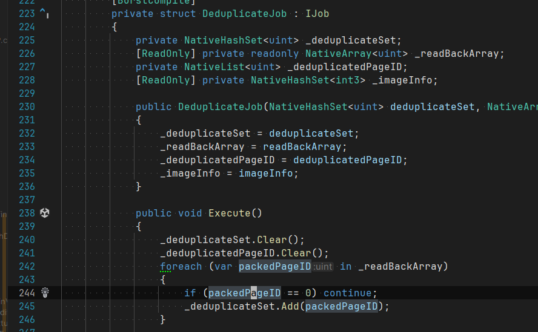
    - 在unpack page id之前就先dedup，因为output pageid是编码到一个uint32中的
    - 跳过 == 0 的page，减少hashset.add消耗，并放入burstjob中去处理
    - 使用compute shader捋一遍，结果放入appendstructurebuffer中，本文的实现中未作尝试
  - 对GPU Feedback做补充：个人感觉这是个经验和工程相结合的复杂问题，在本文的实现中粗暴地补充了所有sector的mip8作为additional feedback page，实际上需要通过相机位置/视角去预判一些关键性的page来减少page miss导致的模糊问题。
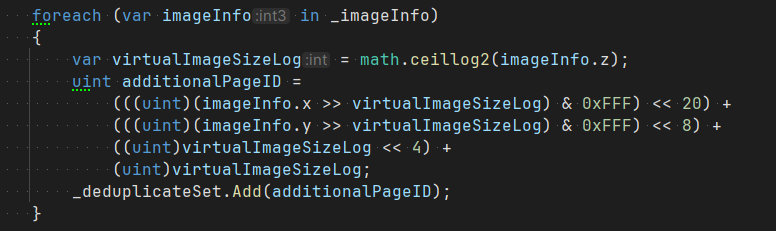

  - Page ID的xy超出12bit精度范围
    - 还是输出实际的世界空间的world virtual uv，但是增加一个相对坐标偏移，例如每隔512米作为一个动态坐标原点，回读回CPU后再重新加上设定好的坐标原点。这是星球重启项目中正在使用的方式dev by章敏捷。
    - 直接输出virtual image atlas的uv，实际上就是indirection texture的UV，对于far cry项目使用的2K indirection texture来说，11bit足够了（实际chenka的分享中给了12bit）。

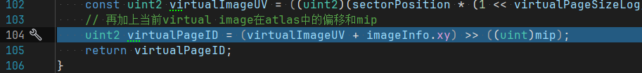
  - AVT分享中indirection和feedback记录的mip都是virtualimage的mip，而不是1024texels/m。virtualimage的mip加上（8-virtualPageSizeLog）才是实际以1024texels/m的mip。这个跟page按照mip来排序是一个道理，原文分享中清晰地提到两者在一个空间下（same space）
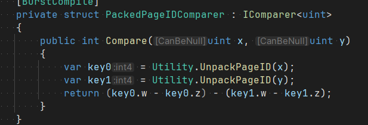
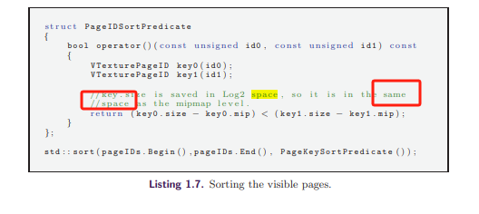
  - Output page ID buffer的尺寸被优化到了1/8 \* 1/8 是因为两点原因:
    - 临近pixel的page大概率是相同的，并使用dither来打散帧与帧之间的输出pixel
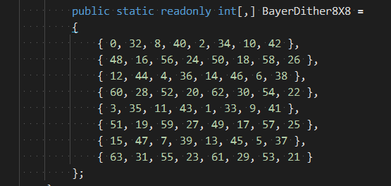
    - 以每秒60帧计算一次VT状态机循环10帧内几秒内足以output所有的pixels了
  - 写入UAV的pixel shader需要声明force early depth-stencil，Chen Ka在提问环节也回答了这个问题。
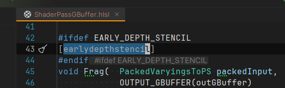
  文档里说的很清楚：https://learn.microsoft.com/en-us/windows/win32/direct3dhlsl/sm5-attributes-earlydepthstencil
- HDRP injection point没有before GBuffer Pass
  - HDRP允许用户在管线特定阶段插入自定义pass，如图所示。我们需要的各种操作都刚好是在GBuffer pass之前。比如bind feedback使用的UAV Output Page ID Buffer，开启feedback相关的shader keyword。又比如dispatch remap indirection texture的compute shader。
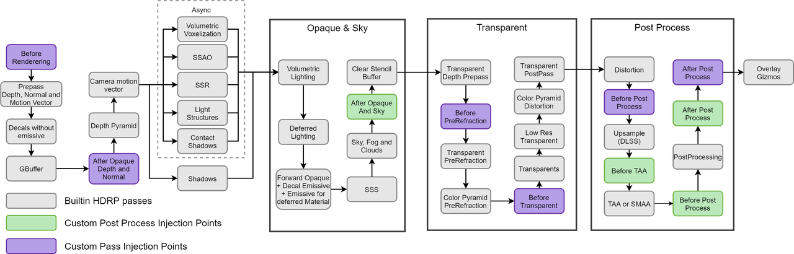
  - 附一个官方文档的链接：https://docs.unity3d.com/Packages/com.unity.render-pipelines.high-definition@16.0/manual/Custom-Pass-Injection-Points.html
  - 补上就好了（😊
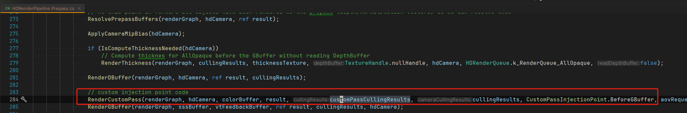
- 关于indirection texture的remap的一些想法：
  - 分享中提到upscale的时候原mip1的entry写入新mip0的entry中使用，虽然会糊一些，但很快会被新feedback发现这里需要真正的mip0而被刷新变清晰。这有好处有坏处，在我的实现中查询indirection texture会递归地往低级mip上去找，直到（maximum mip），这样当mip0 missing的时候本来就会去找mip1，但是如果能直接在mip0 entry上索引到mip1的physical page，sample vt的实现上也许可以避免这个递归，获得性能提升。坏处是需要在indirection texture上记录当前entry对应的mip（原实现上是PageID+mip+debug编码为UINT32，而本文的实现只是用了UINT16）。
- 使用compute shader写入indirection texture的时候遇到8 maximum UAVs的问题，其实这个UAV数量的问题使用DX12是支持的，但是unity引擎没有处理好这个报错，用renderdoc抓一帧看了一下，bind成功了，免得被迫拆分for循环，偷懒了（😊
  - 更新：拆分了UAV bind，避免了同时使用超过8个UAVs的情况，报错没有了
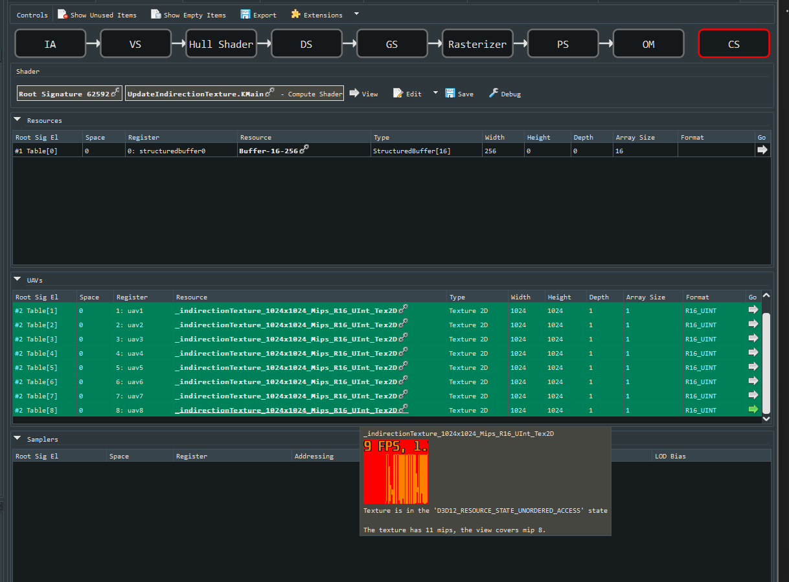
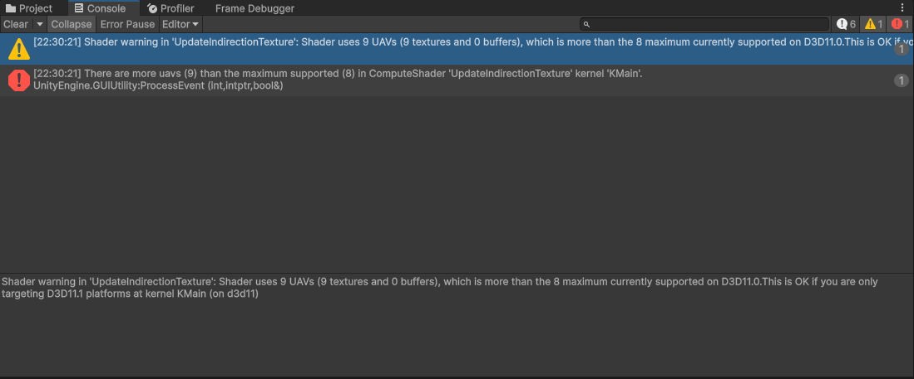
- SRP Core提供了一个从C#生成hlsl shader code的方式，这样可以更好更方便地将常量对应起来。https://docs.unity3d.com/Packages/com.unity.render-pipelines.core@16.0/manual/generating-shader-includes.html

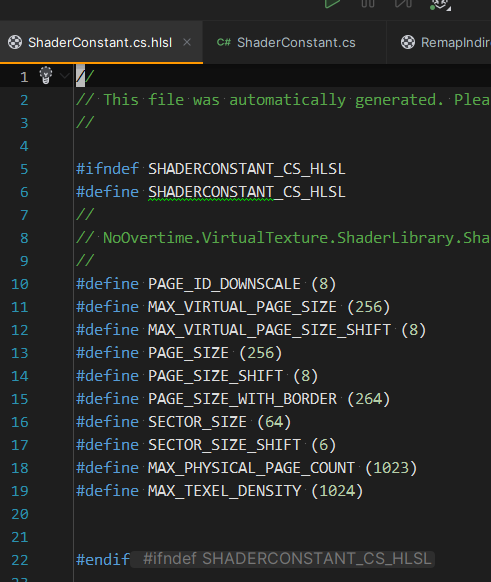
### 性能测试：
- CPU开销：

- GBuffer Pass:
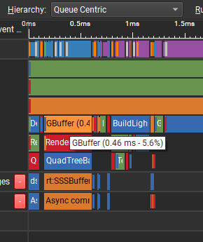

- 每帧最多同时Bake 16个physical page：
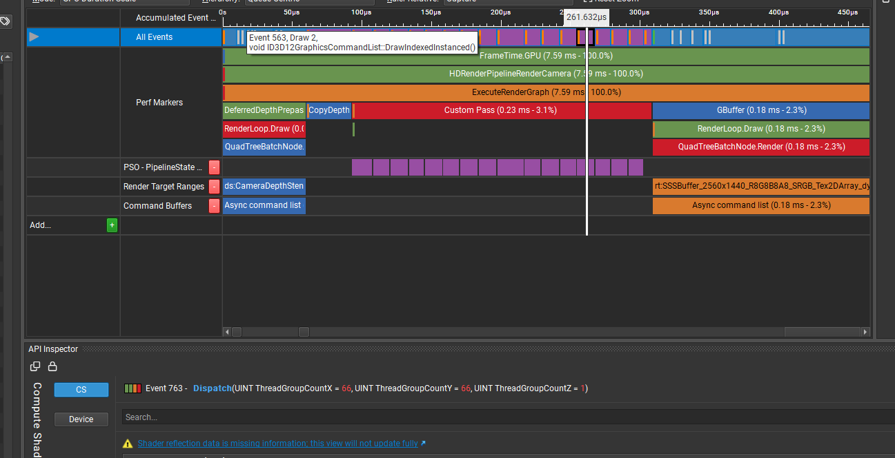
### Repo地址：
- https://github.com/lifangjie/HDRPVirtualTexture
### Reference：
- By 李兵：https://zhuanlan.zhihu.com/p/138484024
- Chen, K. "Adaptive virtual texture rendering in far cry 4." Game Developers Conference. 2015.
- Chen, Ka. "Adaptive Virtual Textures." GPU Pro 7: Advanced Rendering Techniques 131 (2016).
